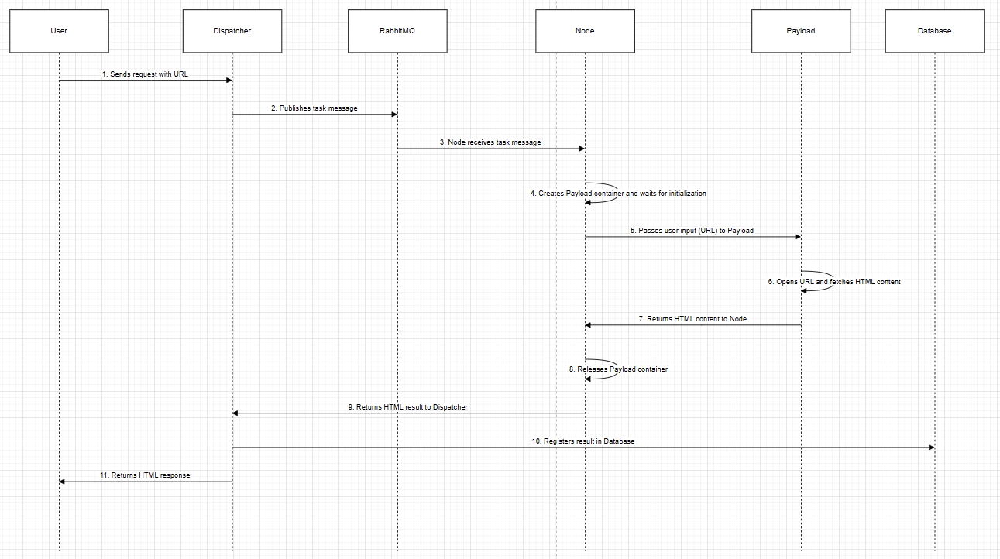
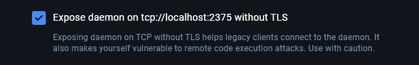

# Browsely Architecture Overview

Respecting the fact that as little code as possible was needed, the goal was to demonstrate the architecture of a scalable, modular microservice solution using best practices, though it may be overengineered for small tasks. Services are modular, allowing independent scaling and deployment for more complex scenarios as the system grows.



## Quick Start

### Prerequisites

Before running the application, set the execution policy if needed:

```powershell
Set-ExecutionPolicy RemoteSigned -Scope CurrentUser
```

### Exposing Docker API for Browserless

To run Browserless dynamically from a container and access Docker API, you need to expose the Docker daemon on TCP without TLS, as shown in the screenshot. This configuration allows services inside containers to communicate directly with the Docker daemon for actions like launching or managing additional containers.

### Configuration

Enable the option:
**Expose daemon on tcp://localhost:2375 without TLS**



#### Why This Is Necessary

This setup is required because the Browserless service dynamically interacts with Docker to spin up and manage instances. Access to the Docker API enables Browserless Container to control these instances programmatically.

#### Security Consideration

- **Warning**: Exposing the Docker daemon without TLS can make your system vulnerable to remote code execution attacks. Use this setup cautiously and ensure it’s applied only in trusted and secure environments.

## Step 1: Start the Application

Navigate to the root directory of the project.
Run the following script:

```powershell
./start.ps1
```

This script will pull all necessary Docker images, and `docker-compose` will build and run the services.

## Step 2: Docker Services

The architecture is based on the following `docker-compose` configuration:

### Services Overview

1. **Dispatcher API**:
   - **Access URL**: [http://localhost:8081](http://localhost:8081)
   - **Swagger**: [http://localhost:8081/swagger/index.html](http://localhost:8081/swagger/index.html)
   - **Ports**: `5163` (API), `8081` (Swagger)
2. **Node API**:
   - **Access URL**: [http://localhost:8082](http://localhost:8082)
   - **Ports**: `5058` (API), `8082` (Service)
3. **RabbitMQ**:

   - **Access URL**: [http://localhost:15672](http://localhost:15672) (RabbitMQ Management UI)
   - **Ports**: `15672` (Management), `5672` (Messaging)

4. **SQL Server**:

   - Runs on port `1434`, with data stored in the `./data/sqldata` volume.

5. **Seq (Logging and Monitoring)**:
   - **Access URL**: [http://localhost:88](http://localhost:88)
   - **Ports**: `88` (HTTP), `5341` (API)

## Step 3: Accessing the APIs

Access Swagger for testing and exploring the Dispatcher API at [http://localhost:8081/swagger/index.html](http://localhost:8081/swagger/index.html).

### API Endpoints

**Get URL Details**:

```bash
curl -X 'GET' 'http://localhost:8081/url/01JB6VZ0N3SWWJ0MY4JDR0XT40' -H 'accept: */*'
```

**Response**:

```json
{
  "id": "01JB6VZ0N3SWWJ0MY4JDR0XT40",
  "url": "https://trgint.com/",
  "state": "Active",
  "content": "...",
  "createdAt": "2024-10-27T11:32:13.0917936",
  "updatedAt": "2024-10-27T11:32:20.7196668"
}
```

**Post URL for Review**:

```bash
curl -X 'POST' 'http://localhost:8081/url/review' -H 'accept: */*' -H 'Content-Type: application/json' -d '{
  "uri": "https://trgint.com/"
}'
```

**Response**:
`    01JB6VZ0N3SWWJ0MY4JDR0XT40
   `

The response ID can be used to fetch the payload once the processing is complete.

## Overview

Utilizes CQRS and Domain-Driven Design (DDD) principles. While kept in one solution for simplicity, real setups would have services in separate repositories for independent development, deployment, and scaling.

## Components

### Dispatcher Service:

Manages URL scheduling, reviews, and updates. Divided into API, Application, Domain, and Infrastructure layers, using CQRS to separate queries and commands.

### Node Service:

Handles URL content retrieval via Dockerized services (e.g., Browserless). Manages URL review events with event-driven processing using messaging.

### Payload Service:

- Fetching content using the browserless/chrome image, which is bootstrapped as needed. The Node Service orchestrates this process, running only when an event is received.

## Technologies Overview

### Entity Framework Core (EF Core)

Manages database interactions via an object-oriented API. Simplifies data access and validation, reducing boilerplate code.

### RabbitMQ - Message Broker

Manages asynchronous communication, triggering events (e.g., URL reviews) that other modules respond to, promoting loose coupling.

### Seq (or Similar) - Logging and Monitoring

Collects and analyzes logs across components for system visibility, error detection, and resolution. In real case most likly we will need OpenTelemetry.

### Testing

We have implemented unit testing, but we deferred integration testing due to its complexity. Given our dependencies such as RabbitMQ, MSSQL, and Seq, we would need to use Testcontainers for containerizing these services and the ASP.NET Core Test Host to mock Kestrel effectively. This setup will allows for a realistic simulation of the application environment during integration tests.

# Areas for Improvement

### Authorization:

Currently, there's no implementation for securing endpoints or resources. Adding authentication and authorization using ASP.NET Identity or OAuth2 (e.g., using IdentityServer or Azure AD) would enhance security.

### Telemetry and Monitoring:

The project is missing telemetry for tracking application performance and health. Integrating Application Insights or OpenTelemetry can provide visibility into system behavior, including request tracing, exception logging, and performance metrics.

### Key Vault:

There’s no secure vault like Azure Key Vault for storing sensitive information (e.g., connection strings, API keys). Integrating a secure vault would safeguard credentials and allow for secure configuration management.

### Security Enhancements:

Consider implementing HTTPS/TLS enforcement and secure headers (e.g., HSTS) to improve API security.
Adding middleware for rate limiting and input validation can protect the application from attacks like DDoS and SQL injection.

### Integration Testing:

To fully test the integration between components (e.g., RabbitMQ, MSSQL, Seq), implementing integration tests using Testcontainers and ASP.NET Core Test Host would be beneficial. This setup would simulate real environments, ensuring dependencies are correctly configured and functional.
